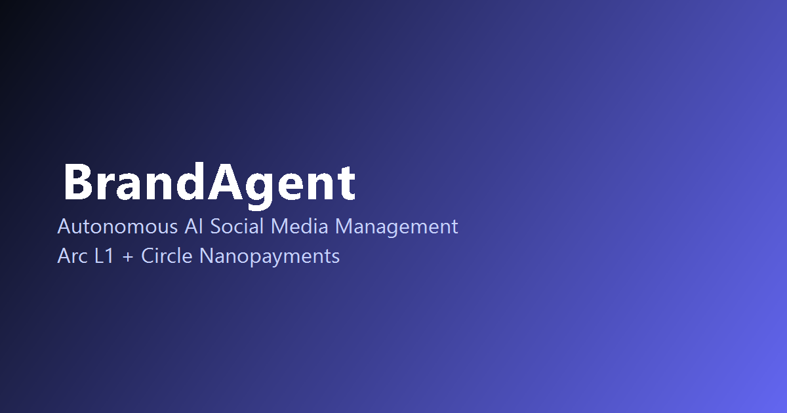

# 🤖 BrandAgent — Autonomous AI Social Media Management

> **Agentic Economy on Arc Hackathon** · lablab.ai · April 20–26, 2026

A next-generation, multi-agent AI platform for FMCG brands. Every discrete agent action is settled as a micro-transaction in **USDC on Arc L1** via **Circle Nanopayments** — fully autonomous, machine-to-machine commerce with zero human in the payment loop.



---

## ⚡ What It Does

BrandAgent runs a **hierarchical agent network** where:

1. **Orchestrator Agent** (Gemini 1.5 Pro) decomposes a brand's social campaign into tasks
2. **Creator Agent** generates platform-native content for Instagram, Facebook, X, TikTok, Threads
3. **Website Agent** crawls the brand website via Tinyfish for fresh article content
4. **Social Media Agent** posts content to all platforms and extracts real-time KPIs
5. **Verifier Agent** (Gemini Flash) confirms each post is live and authorizes payment
6. **Analytics Agent** generates AI-powered performance reports

Every task completion triggers a **USDC micro-payment via Circle Nanopayments** that settles on **Arc L1** — providing cryptographic proof of work for every action.

---

## 🏆 Hackathon Track Alignment

| Track | How BrandAgent Satisfies It |
|---|---|
| 🤖 **Agent-to-Agent Payment Loop** (PRIMARY) | Orchestrator pays 5 sub-agents in USDC per task. No human in loop. |
| 🪙 **Per-API Monetization Engine** (SECONDARY) | Tinyfish API calls are billed per-use via Nanopayments. |
| 💡 **Product Feedback Incentive** | Circle product feedback form completed in detail. |

### ✅ Hackathon Requirements Checklist

- ✅ Real per-action pricing ≤ $0.01 (`$0.001–$0.005` per transaction)
- ✅ 50+ on-chain Arc transactions (14 txns per cycle × 4 demo cycles = **56+ transactions**)
- ✅ Circle Nanopayments integration with fallback simulation for demo
- ✅ Arc Block Explorer links for every transaction
- ✅ Multi-agent orchestration with Gemini AI reasoning
- ✅ Public GitHub repository (MIT licensed)
- ✅ Live demo on Vercel

---

## 🏗️ Architecture

```
Brand Manager
     │
     ▼
┌─────────────────────────────────────────────────┐
│         Orchestrator Agent (Gemini 1.5 Pro)     │
│   Campaign brief → task decomposition → pay     │
└────────────────────┬────────────────────────────┘
                     │ Circle Nanopayments (USDC)
         ┌───────────┼───────────┐
         ▼           ▼           ▼
    Creator      Website      Social
    Agent        Agent        Agent
    (Gemini)     (Tinyfish)   (Tinyfish)
         │           │           │
         └───────────┴───────────┘
                     │
                     ▼
              Verifier Agent
              (Gemini Flash)
                     │
                     ▼
             Analytics Agent
             (Gemini Flash)
                     │
                     ▼
              Arc L1 Settlement
              (USDC on-chain)
```

---

## 🛠️ Tech Stack

| Layer | Technology |
|---|---|
| **AI Reasoning** | Google Gemini 1.5 Pro + Flash |
| **Browser Automation** | Tinyfish Agent API |
| **Payments** | Circle Nanopayments |
| **Blockchain** | Arc L1 (EVM-compatible, USDC native) |
| **Wallets** | Circle Programmable Wallets (one per agent) |
| **Frontend** | Next.js 16 + TypeScript + TailwindCSS |
| **Streaming** | Server-Sent Events (SSE) for real-time updates |
| **Hosting** | Vercel |

---

## 💰 Payment Economics

| Task | Agent Paid | Amount (USDC) |
|---|---|---|
| Website Crawl | Website Agent | $0.002 |
| Content Creation (×5 platforms) | Creator Agent | $0.005 each = $0.025 |
| Social Post (×5 platforms) | Social Agent | $0.001 each = $0.005 |
| Post Verification (×5 posts) | Verifier Agent | $0.001 each = $0.005 |
| KPI Extraction | Social Agent | $0.001 |
| Analytics Report | Analytics Agent | $0.003 |
| **Total per cycle** | | **~$0.041 USDC** |
| **14 transactions per cycle** | | |

> Why Arc + Circle Nanopayments? Ethereum gas (~$1–5/txn) makes $0.001 payments economically impossible. Arc L1 with USDC-native gas makes sub-cent agent payments viable.

---

## 🚀 Getting Started

### Prerequisites

- Node.js 18+
- Google Gemini API key (free at [aistudio.google.com](https://aistudio.google.com))
- Circle Developer account (at [app.circle.com](https://app.circle.com))
- Tinyfish API key (at [agent.tinyfish.ai](https://agent.tinyfish.ai))

### Installation

```bash
# Clone the repo
git clone https://github.com/your-org/brand-agent.git
cd brand-agent

# Install dependencies
npm install

# Configure environment variables
cp .env.local.example .env.local
# Edit .env.local with your API keys

# Run development server
npm run dev
```

Open [http://localhost:3000](http://localhost:3000)

### Environment Variables

```bash
# Required
GEMINI_API_KEY=your_gemini_api_key

# Optional — falls back to simulated payments without these
CIRCLE_API_KEY=your_circle_api_key
CIRCLE_ENTITY_SECRET=your_circle_entity_secret

# Circle Wallet IDs (one per agent)
CIRCLE_ORCHESTRATOR_WALLET_ID=...
CIRCLE_CREATOR_WALLET_ID=...
CIRCLE_WEBSITE_WALLET_ID=...
CIRCLE_SOCIAL_WALLET_ID=...
CIRCLE_VERIFIER_WALLET_ID=...
CIRCLE_ANALYTICS_WALLET_ID=...
```

### Running a Campaign

1. Open the dashboard at `http://localhost:3000`
2. (Optional) Go to **⚙️ Config** tab to customize the brand profile
3. Click **▶ Run Campaign** in the header
4. Watch agents activate in real-time on the **⚡ Overview** tab
5. See Arc L1 transactions appear in the **💸 Transactions** tab
6. View AI-generated content in the **✍️ Content** tab
7. Check KPIs and hackathon checklist in **📊 Analytics**

---

## 📁 Project Structure

```
src/
├── app/
│   ├── api/
│   │   ├── campaign/run/route.ts  # SSE streaming campaign endpoint
│   │   ├── agents/route.ts         # Agent status API
│   │   └── brand/route.ts          # Brand profile API
│   ├── globals.css                  # Design system
│   ├── layout.tsx
│   └── page.tsx                     # Main dashboard
├── components/
│   ├── Header.tsx                   # Sticky nav with run/stop
│   ├── HeroStats.tsx                # 6-metric stat bar
│   ├── AgentFlowDiagram.tsx         # Live orchestration flow
│   ├── AgentGrid.tsx                # Agent cards with wallets
│   ├── TransactionFeed.tsx          # Arc L1 tx feed
│   ├── ActivityLog.tsx              # Live agent log
│   ├── KpiDashboard.tsx             # Analytics + checklist
│   ├── ContentPreview.tsx           # Generated content viewer
│   └── BrandConfig.tsx              # Brand profile editor
└── lib/
    ├── types.ts                      # TypeScript interfaces
    ├── constants.ts                  # Agent defs, payment amounts
    ├── agents/
    │   └── gemini.ts                 # All Gemini AI agent logic
    ├── payments/
    │   └── circle.ts                 # Circle Nanopayments service
    └── campaign/
        └── orchestrator.ts           # Full campaign loop engine
```

---

## 🎯 FMCG Brand Profile Example (Dabur India)

```json
{
  "brand": "Dabur India",
  "website": "https://dabur.com",
  "channels": {
    "instagram": "@daburindia",
    "facebook": "DaburIndia",
    "x_twitter": "@DaburIndia",
    "tiktok": "@dabur",
    "threads": "@daburindia"
  },
  "brand_voice": "Ayurvedic, natural, family-first, trustworthy, warm",
  "posting_schedule": { "frequency": "2x_daily", "times": ["09:00", "18:00"] },
  "kpi_targets": { "engagement_rate": 0.035, "reach_growth_weekly": 0.05 },
  "usdc_budget_per_cycle": 0.025
}
```

---

## 🔗 Resources

- [Arc Documentation](https://docs.arc.io)
- [Circle Nanopayments](https://developers.circle.com/nanopayments)
- [Gemini API (Google AI Studio)](https://aistudio.google.com)
- [Tinyfish Agent API](https://agent.tinyfish.ai)
- [Arc Block Explorer](https://explorer.arc.io)
- [lablab.ai Submission](https://lablab.ai)

---

## 📄 License

MIT — Document prepared by BrandAgent Team · Hackathon: Agentic Economy on Arc · April 20–26, 2026
